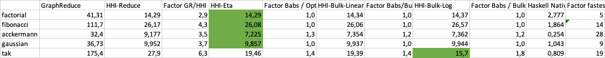

# Optimizing bracket abstraction for Combinator based interpreters

## Abstract

In this post i will show how to significantly improve the performance of a combinator based interpreter by using an alternative abstraction algorithm. This algorithm is based on the paper [Optimizing bracket abstraction](https://okmij.org/ftp/tagless-final/ski.pdf) by Oleg Kiselyov and closely follows Ben Lynn's implementation of Kiselyov's algorithm in [his blog post](https://crypto.stanford.edu/~blynn/lambda/kiselyov.html).

I will also give some performance comparisons between the different approaches.

## Introduction

In previous blog posts i have shown how functional languages can be implemented using a small set of combinators. 

**The first post**, [Implementing a functional language with Graph Reduction](https://thma.github.io/posts/2021-12-27-Implementing-a-functional-language-with-Graph-Reduction.html) described an approach that sets up three major components:

- A parser for a tiny functional language based on the untyped λ-calculus.

- A compiler from λ-calculus to a fixed set of combinatory logic combinators (S,K,I,B,C and Y (aka. SICKBY)). This compiler uses traditional bracket abstraction algorithms to encode λ-terms as combinators.

- A graph-reduction engine which implements the combinator rewrite rules as an efficient graph reduction

**In the second post**, [Evaluating SKI combinators as native Haskell functions](https://thma.github.io/posts/2022-02-05-Evaluating-SKI-combinators-as-native-Haskell-functions.html), I showed how the combinators can be implemented as native Haskell functions. This allows to evaluate the combinators directly in Haskell without the need for a graph reduction engine.

The parser and the compiler of the first post could be reused without any changes. I just had to plug in a different execution engine. This time based on native Haskell functions instead of graph reduction.

I also did some performance measurements and found that the version unsing native Haskell functions is about 10-100 times faster than the graph reduction engine.

Another significant finding was that the performance of functions with two or more arguments was significantly worse than the performance of functions with one argument. 

This is caused by the inefficient code generation of the classic bracket abstraction: [The output size grows quadratic](https://tromp.github.io/cl/LC.pdf) with internal complexity and number of variables. As each additional combinator or application will require additional execution time it’s easy to see why a quadratic growth in combinator code size will drastically decrease performance. There have been many attempts to optimize bracket abstraction by [introducing additional combinators](https://www.cantab.net/users/antoni.diller/brackets/intro.html) and by applying additional optimization rules.

**In the present post** i will show how to significantly improve the performnce by using an alternative abstraction algorithm. This algorithm is based on the paper [Optimizing bracket abstraction](https://okmij.org/ftp/tagless-final/ski.pdf) by Oleg Kiselyov.

My implementation closely follows Ben Lynn's implementation of Kiselyov's algorithm in [his blog post](https://crypto.stanford.edu/~blynn/lambda/kiselyov.html). I have made only minor changes to make the code more readable and to make it work with the parser and compiler of the first post.

## From λ-calculus to combinators

My parser can parse programs of a very rudimentary language that is basically just pure λ-calculus plus integers. Here is an example:

```haskell
sqr  = \x -> * x x
main = sqr 3
```

The parser will produce an environment of top-level definitions from this program:


```haskell
[("sqr",Lam "x" (App (App (Var "*") (Var "x")) (Var "x"))), 
 ("main",App (Var "sqr") (Int 3))]
```

Data types for λ-expressions and the environment are defined as follows:

```haskell
data Expr
  = App Expr Expr
  | Var String
  | Int Integer
  | Lam String Expr
  deriving (Eq, Show)

type Environment = [(String, Expr)]
```

Now we can define a compiler that translates such λ-expressions to combinator terms. 

Combinator terms are defined as follows:

```haskell
data CL = Com Combinator | INT Integer | CL :@ CL

data Combinator = I | K | S | B | C | Y | R | B' | C' | S' | T |
                  ADD | SUB | MUL | DIV | REM | SUB1 | EQL | GEQ | ZEROP  
  deriving (Eq, Show)
```


## to be continued...

## performance comparison



## Conclusion
